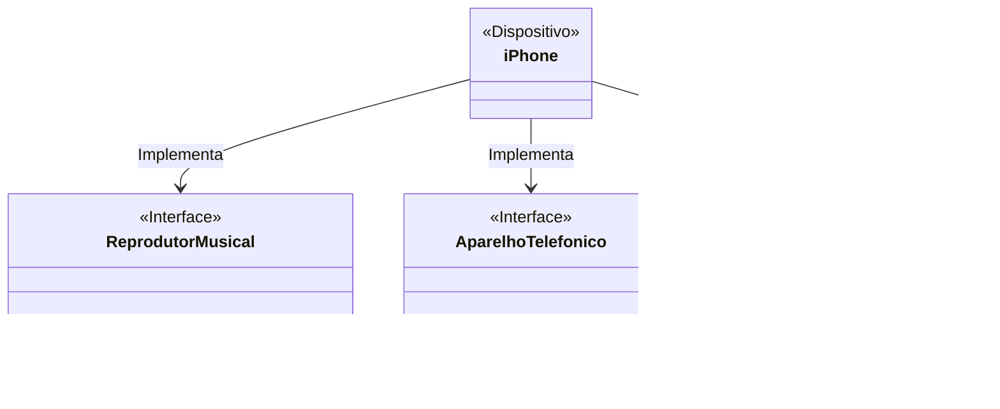

```mermaid
classDiagram
    class iPhone {
        <<Dispositivo>>
    }

    class ReprodutorMusical {
        <<Interface>>
        +tocar()
        +pausar()
        +selecionarMusica(String musica)
    }

    class AparelhoTelefonico {
        <<Interface>>
        +ligar(String numero)
        +atender()
        +iniciarCorreioVoz()
    }

    class NavegadorInternet {
        <<Interface>>
        +exibirPagina(String url)
        +adicionarNovaAba()
        +atualizarPagina()
    }

    iPhone --> ReprodutorMusical : Implementa
    iPhone --> AparelhoTelefonico : Implementa
    iPhone --> NavegadorInternet : Implementa
```
